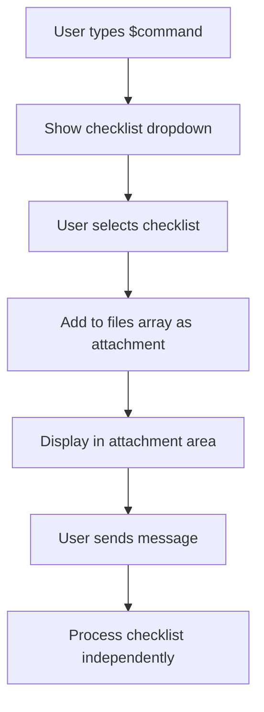

# Checklist Functionality Improvement Plan

## Current Issues Analysis

### Problem 1: Prompt Command Resolution Failure
- **Issue**: `$tender-req` checklist shows "❌ Prompt not found" for all 7 prompts
- **Root Cause**: `getPromptByCommand()` cannot find prompts with commands like `/business-trips`, `/local-specialists`, etc.
- **Technical Cause**: Checklist items reference prompt commands that don't exist in the prompts database

### Problem 2: Incorrect UX Pattern
- **Current**: Checklist content is inserted directly into chat message
- **Desired**: Checklist should attach as artifact (like Knowledge) and process independently
- **Impact**: Creates cluttered, unusable chat interface

### Problem 3: Sequential vs Parallel Execution
- **Current**: Attempts to concatenate all prompt responses into one message
- **Desired**: Each prompt runs independently against the user's message
- **Missing**: Tabular results display with independent answers

## Proposed Solution Architecture

### Phase 1: Checklist Attachment System
**Goal**: Treat checklists as attachments rather than inline commands

#### 1.1 UI Changes
- **File**: `MessageInput.svelte`
- **Change**: Add checklist to files array when selected with `$command`
- **Display**: Show checklist in file attachment area (similar to knowledge/documents)
- **Visual**: Checklist icon + title + prompt count

#### 1.2 Attachment Processing
```typescript
// New checklist file type
interface ChecklistAttachment {
  type: 'checklist',
  id: string,
  command: string,
  title: string,
  items: ChecklistItem[],
  status: 'attached' | 'processing' | 'completed'
}
```

### Phase 2: Independent Prompt Execution
**Goal**: Execute each checklist prompt as separate API calls

#### 2.1 Execution Engine
- **File**: New `ChecklistProcessor.ts`
- **Function**: Process checklist items independently
- **Input**: User message + attached files + checklist items
- **Output**: Array of individual prompt responses

#### 2.2 API Integration
```typescript
interface ChecklistExecution {
  checklistId: string,
  userMessage: string,
  results: {
    promptTitle: string,
    promptContent: string,
    response: string,
    status: 'success' | 'error',
    error?: string
  }[]
}
```

### Phase 3: Results Display
**Goal**: Show checklist results in tabular format

#### 3.1 Results Component
- **File**: New `ChecklistResults.svelte`
- **Layout**: Table with columns: Prompt, Response, Status
- **Features**: Expandable rows, copy functionality, no follow-up chat

#### 3.2 Chat Integration
- **Display**: Special message type for checklist results
- **Isolation**: Results are read-only, no regeneration or follow-up
- **Export**: Option to export results as CSV/PDF

## Implementation Phases

### Phase 1: Fix Current Command Resolution (Quick Fix)
**Timeline**: 1-2 hours
**Files Modified**: 
- `Commands/Checklists.svelte`
- `ChecklistProcessor` logic

**Changes**:
1. Fix prompt command lookup logic
2. Handle missing prompts gracefully
3. Improve error messaging

### Phase 2: Attachment System Redesign
**Timeline**: 4-6 hours
**Files Modified**:
- `MessageInput.svelte`
- `Commands/Checklists.svelte` 
- `FileItem.svelte` (extend for checklists)

**Changes**:
1. Modify `$command` to attach checklist instead of inline execution
2. Add checklist display in file attachments area
3. Remove inline execution from chat input

### Phase 3: Independent Execution Engine
**Timeline**: 6-8 hours
**New Files**:
- `lib/utils/ChecklistProcessor.ts`
- `lib/components/chat/ChecklistResults.svelte`

**Changes**:
1. Create parallel execution system
2. Implement tabular results display
3. Add proper error handling and status tracking

### Phase 4: Enhanced UX Features
**Timeline**: 2-4 hours
**Features**:
1. Progress indicators during execution
2. Results export functionality
3. Checklist template management
4. Batch processing optimization

## Technical Implementation Details

### 1. Checklist Attachment Flow


### 2. Independent Execution
```typescript
class ChecklistProcessor {
  async executeChecklist(
    checklist: Checklist,
    userMessage: string,
    attachedFiles: File[]
  ): Promise<ChecklistExecution> {
    const results = await Promise.all(
      checklist.items.map(item => 
        this.executePromptItem(item, userMessage, attachedFiles)
      )
    );
    return { checklistId: checklist.id, userMessage, results };
  }
}
```

### 3. Results Display Component
```svelte
<!-- ChecklistResults.svelte -->
<div class="checklist-results">
  <h3>{checklist.title} Results</h3>
  <table>
    <thead>
      <tr>
        <th>Prompt</th>
        <th>Response</th>
        <th>Status</th>
      </tr>
    </thead>
    <tbody>
      {#each results as result}
        <tr class={result.status}>
          <td>{result.promptTitle}</td>
          <td class="response-cell">{result.response}</td>
          <td class="status-{result.status}">{result.status}</td>
        </tr>
      {/each}
    </tbody>
  </table>
</div>
```

## File Structure Changes

### New Files
```
src/lib/
├── utils/
│   └── ChecklistProcessor.ts        # Core execution logic
├── components/
│   └── chat/
│       ├── ChecklistResults.svelte  # Results display
│       └── ChecklistAttachment.svelte # Attachment UI
└── types/
    └── checklist.ts                 # Enhanced type definitions
```

### Modified Files
```
src/lib/components/
├── chat/
│   ├── MessageInput.svelte          # Add checklist attachment
│   ├── MessageInput/
│   │   └── Commands/
│   │       └── Checklists.svelte    # Change to attachment mode
├── common/
│   └── FileItem.svelte              # Support checklist type
```

## Migration Strategy

### Step 1: Immediate Fix (Today)
- Fix current prompt resolution errors
- Improve error handling and messaging
- Ensure existing functionality works

### Step 2: Gradual Migration (This Week)
- Implement attachment system alongside current inline system
- Add feature flag to toggle between modes
- Test with existing checklists

### Step 3: Full Migration (Next Week)
- Remove inline execution mode
- Deploy attachment-based system
- Update user documentation

## Success Metrics

### Functionality
- [ ] Checklist attaches like knowledge artifacts
- [ ] Each prompt executes independently 
- [ ] Results display in table format
- [ ] No "❌ Prompt not found" errors
- [ ] Export functionality works

### Performance
- [ ] Parallel execution faster than sequential
- [ ] Minimal UI blocking during processing
- [ ] Graceful handling of failed prompts

### UX
- [ ] Clean chat interface (no inline content)
- [ ] Clear progress indicators
- [ ] Intuitive attachment workflow
- [ ] Professional results presentation

## Risk Assessment

### High Risk
- **Breaking Changes**: Current checklist users need migration
- **API Load**: Parallel execution may increase server load
- **Data Loss**: Migration could lose existing checklist configurations

### Medium Risk  
- **UI Complexity**: Attachment system adds interface complexity
- **Performance**: Large checklists may timeout or consume resources

### Low Risk
- **User Adoption**: New UX pattern may require training
- **Compatibility**: Need to maintain backward compatibility during transition

## Testing Strategy

### Unit Tests
- ChecklistProcessor execution logic
- Command resolution and error handling
- Results formatting and display

### Integration Tests
- End-to-end checklist workflow
- API integration with parallel calls
- File attachment system integration

### User Acceptance Tests
- Create and execute test checklists
- Verify results accuracy and formatting
- Test error scenarios and edge cases

---

**Priority**: High (P0) - Critical functionality broken
**Estimated Effort**: 16-20 hours development + 4-6 hours testing
**Dependencies**: None (self-contained changes)
**Timeline**: Complete within 1 week